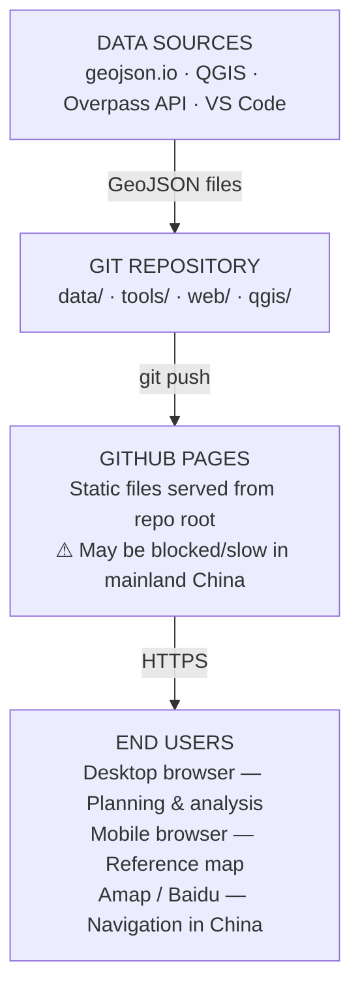
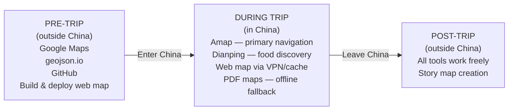
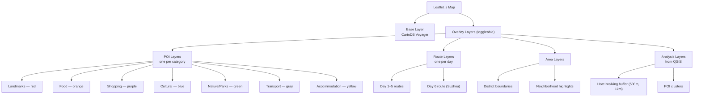

# Architecture

## System Overview



## Key Architecture Decisions

### 1. Static-Only Architecture (No Backend)

**Decision:** No server, no database. Everything is static files + GitHub Pages.

**Why:**
- Zero cost (free GitHub Pages hosting)
- No server maintenance or deployment complexity
- GeoJSON files in Git = built-in version control
- Beginners don't need to learn backend development

**Trade-off:** No real-time collaboration (must push/pull via Git). Acceptable for a 2-person team.

### 2. GeoJSON as the Single Data Format

**Decision:** All spatial data stored as GeoJSON files in the repository.

**Why:**
- Human-readable (JSON) — beginners can edit in any text editor
- Git-friendly — diffs are meaningful, merge conflicts are resolvable
- Industry standard — works in QGIS, Leaflet, geojson.io, and every GIS tool
- No data conversion needed between tools

**Trade-off:** Large datasets can make files unwieldy. Not an issue at our scale (< 50 POIs).

### 3. Leaflet.js Over Alternatives

**Decision:** Use Leaflet.js for the web map, not MapLibre GL, Google Maps, or Mapbox.

**Why:**
- Simplest API for beginners — "Hello World" map in 10 lines of HTML
- Massive plugin ecosystem (marker clusters, routing, heatmaps)
- No API key required (with OSM tiles)
- Excellent documentation and tutorials
- Lightweight (~40KB)

### 4. OpenStreetMap Tiles with WGS84 Coordinates

**Decision:** Use free OSM-compatible tile servers (CartoDB Voyager) with WGS84 coordinates only. Do NOT use Chinese tile providers (Gaode/Amap) in the web map.

**Why:**
- Free, no API key, no usage limits for small projects
- WGS84 coordinates align correctly with these tiles
- No coordinate conversion needed

**See:** [GCJ-02 Coordinate Offset](#8-gcj-02-coordinate-offset-strategy) for why we avoid Chinese tile providers.

### 5. QGIS for Desktop Analysis

**Decision:** Use QGIS (not ArcGIS or web-based tools) for spatial analysis.

**Why:**
- Free and open source — no license cost
- Industry standard — valuable skill for sustainability/tourism careers
- Full spatial analysis toolkit (buffers, distances, clustering)
- Can directly read/write GeoJSON
- Cross-platform (Windows, Mac, Linux)

### 6. Primary File Responsibility (Not Exclusive Ownership)

**Decision:** Each person is the primary editor for ~4 category files. Cross-editing is allowed with communication.

```
  Person 1 (Lead)                Person 2
  primary files:                 primary files:
  ┌────────────────────┐         ┌────────────────────┐
  │ landmarks.geojson  │         │ cultural.geojson   │
  │ food.geojson       │         │ shopping.geojson   │
  │ transport.geojson  │         │ nature.geojson     │
  │ accommodation      │         │ suzhou.geojson     │
  └────────────────────┘         └────────────────────┘

  Cross-editing is fine. Use a clear commit message.
```

**Why:**
- With 2 people, merge conflict risk is minimal
- The Lead can resolve any Git issues
- Rigid ownership creates unnecessary friction at this team size
- Primary responsibility ensures someone "owns" data quality per file

**If you discover a POI for someone else's primary file:** Just add it with a descriptive commit message, or share the details so the primary owner can add it.

### 7. GitHub for Collaboration

**Decision:** Use GitHub (not Google Drive, Notion, or shared folders) for all project files.

**Why:**
- Version control — every change is tracked with author and timestamp
- GitHub Pages — built-in free hosting for the web map
- Learning Git is a transferable professional skill
- Issues for task tracking

**Beginner accommodation:** GitHub Desktop (GUI) instead of command-line Git.

### 8. GCJ-02 Coordinate Offset Strategy

```
  THE PROBLEM:
  ┌─────────────────────────────────────────────────────────┐
  │                                                         │
  │  China mandates GCJ-02 coordinates for domestic maps.   │
  │  This shifts WGS84 positions by 200-400 meters.         │
  │                                                         │
  │  Our data (WGS84):     ●  (correct position)            │
  │  On Chinese tiles:        ●  (shifted 300m!)             │
  │                                                         │
  │  Result: markers appear in rivers, wrong buildings.     │
  │                                                         │
  └─────────────────────────────────────────────────────────┘

  OUR STRATEGY:
  ┌─────────────────────────────────────────────────────────┐
  │  1. Store all coordinates in WGS84 (GeoJSON standard)   │
  │  2. Use only WGS84-aligned tiles (OSM, CartoDB)         │
  │  3. For navigation in China → use Amap/Baidu native     │
  │  4. Escape hatch: gcoord library for conversion         │
  └─────────────────────────────────────────────────────────┘
```

### 9. Single-File Web App (Start Simple)

**Decision:** Start with all JavaScript in a single `app.js` file. Split into `map.js`, `controls.js`, `popups.js` only if it exceeds ~300 lines.

**Why:**
- 2 people don't need file-per-developer separation
- Single file is simpler to understand, debug, and maintain
- The current starter template (`web/index.html`) already has inline JS — this is the natural next step
- Can always split later if needed

## China Tech Constraints

```
  ┌─────────────────────────────────────────────────────────┐
  │  ⚠  CRITICAL: Read this before the trip                │
  │                                                         │
  │  China's Great Firewall blocks many tools we use.       │
  │  Plan for this BEFORE entering China.                   │
  └─────────────────────────────────────────────────────────┘
```

### Blocked or Unreliable in China

```
  Tool              Status in China     Mitigation
  ──────────────────────────────────────────────────────────
  GitHub Pages      Intermittently      PDF maps + service
                    blocked             worker pre-cache

  Google Maps       Blocked             Use Amap (高德地图)
                                        or Baidu Maps

  Google services   Blocked             Use Bing or Baidu
  (Translate, etc)                      Download offline packs

  geojson.io        May be slow         Do all data creation
                                        before the trip

  OSM tiles         Slow but works      PDF fallback
```

### Required Prep Before Entering China

```
  ☐  VPN installed and tested (ExpressVPN, Astrill, etc.)
  ☐  Amap (高德地图) — navigation + offline maps downloaded
  ☐  Dianping (大众点评) — restaurant reviews
  ☐  WeChat (微信) — communication
  ☐  Alipay (支付宝) — mobile payments
  ☐  PDF maps exported from QGIS (offline/day-1.pdf through day-6.pdf)
  ☐  Web map pre-loaded on phone browser (hotel WiFi + VPN)
```

### Workflow by Location



## Map Layer Architecture



## Popup Template

```
  ┌──────────────────────────────────────┐
  │  The Bund                            │
  │  外滩              [landmark] Day 1   │
  │                                      │
  │  Iconic waterfront promenade         │
  │  with views of Pudong skyline        │
  │                                      │
  │  Duration: ~60 min   Cost: Free      │
  │  Hours: 24/7                         │
  │  ID: landmark-001                    │
  │                                      │
  │  [Open in Amap]                      │
  └──────────────────────────────────────┘
```

## Technology Versions

| Technology | Version | Notes |
|-----------|---------|-------|
| Leaflet.js | 1.9.x | Latest stable, loaded via CDN |
| QGIS | 3.36+ | LTR recommended |
| GeoJSON | RFC 7946 | WGS84 only |
| GitHub Pages | -- | Served from repo root |
| HTML/CSS/JS | Vanilla | No frameworks |

## Offline Strategy

```
  ┌──────────────────────────────────────────────────────────┐
  │  OFFLINE RELIABILITY RANKING                              │
  │                                                           │
  │  1. Amap offline maps    ████████████  High (just works)  │
  │  2. QGIS PDF exports     ████████████  High (no internet) │
  │  3. Service worker cache  ██████░░░░░  Medium (needs load) │
  │  4. VPN + GitHub Pages    ████░░░░░░░  Low (VPN may fail)  │
  │                                                           │
  │  Strategy: prepare tiers 1+2 as primary.                  │
  │  Tier 3 is nice-to-have. Tier 4 is bonus.                │
  └──────────────────────────────────────────────────────────┘
```

### Tier 1: Amap Offline Maps
Download Shanghai and Suzhou offline maps in Amap. Use for actual turn-by-turn navigation.

### Tier 2: QGIS PDF Exports
Export daily itinerary maps as PDFs (`offline/day-1.pdf` through `day-6.pdf`). Works on any phone with zero internet. **Most reliable** custom offline option.

### Tier 3: Service Worker (Could)
Cache app shell + GeoJSON via service worker. Map tiles won't cache (too large), but POI data and popups will work on a blank map background.

### Why NOT Tile Pre-Download
- Shanghai at zoom 12-16 = ~50,000-100,000 tiles
- OSM's Tile Usage Policy prohibits bulk downloads
- Native apps (Amap, Organic Maps) solve this better
